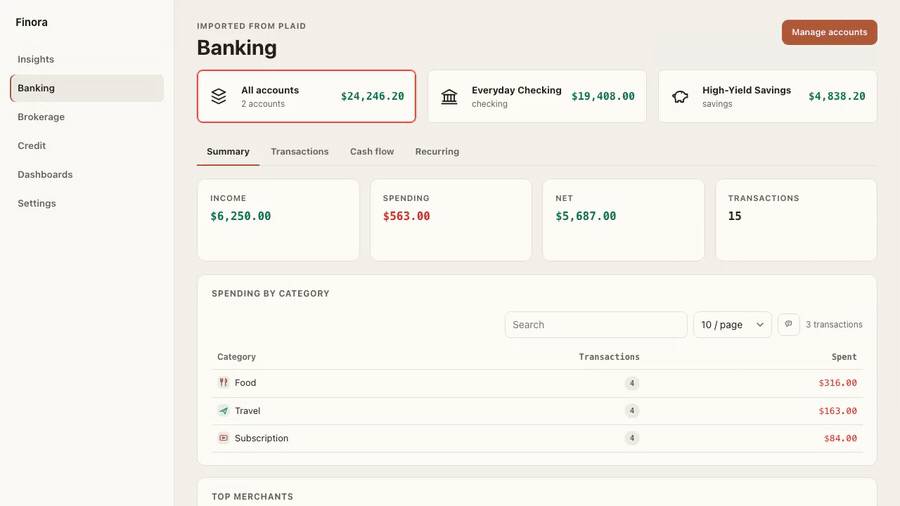
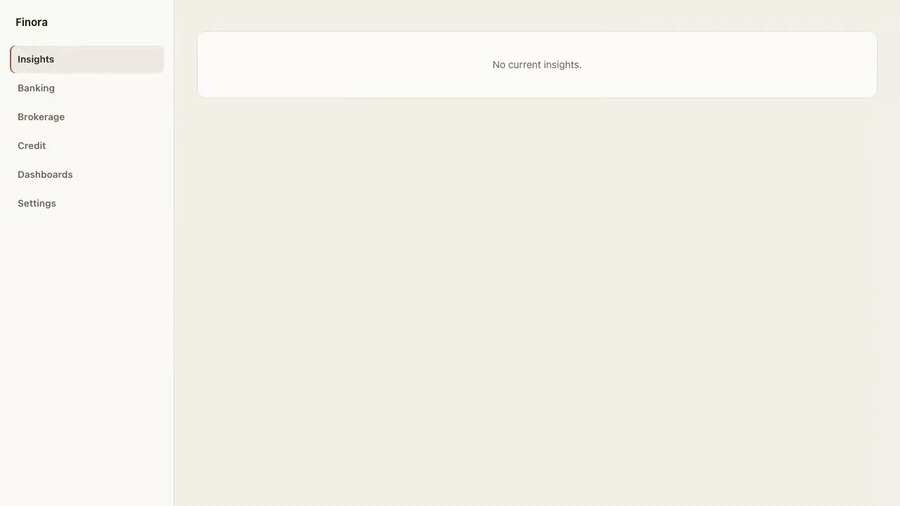
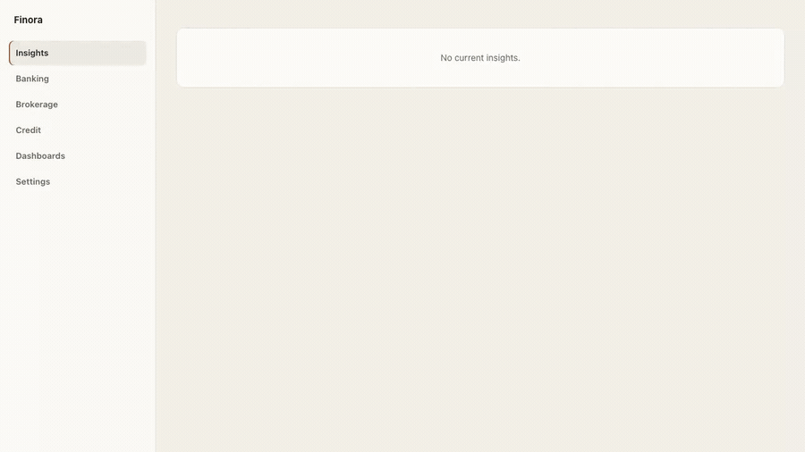
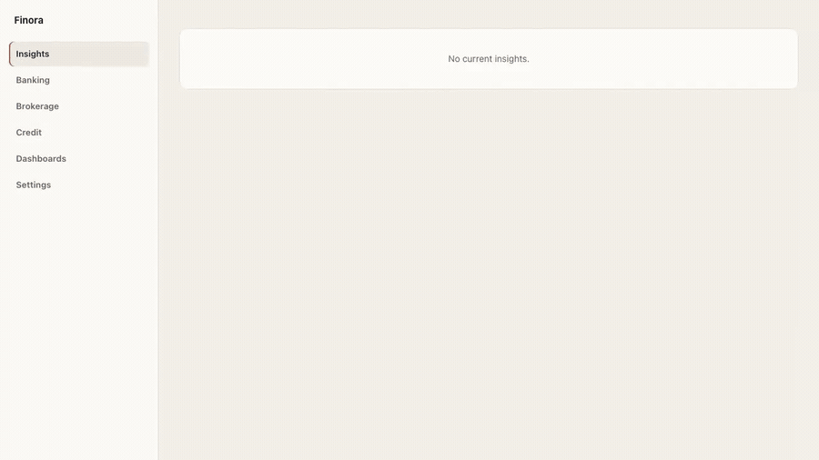
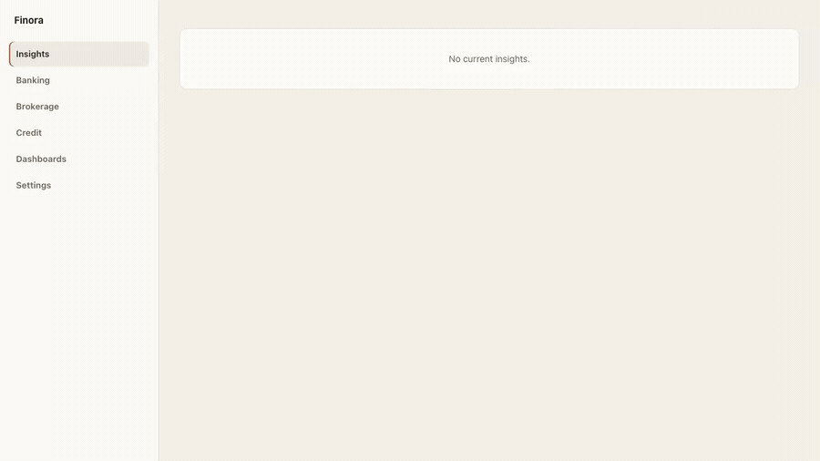

# Finora

**See all your money in one place — privately, on your own computer.**

Finora is a personal finance app that brings your bank accounts, investments,
and credit reports together into one clear picture. It runs on your own laptop
and keeps everything in a single file on your machine — nothing is uploaded to a
finance company's servers.

Finora never moves your money, never stores your bank passwords anywhere online,
and never gives financial advice. It just helps you *see* and *understand* your
money.

## What Finora does for you

- **Everything in one place.** Connect your bank and brokerage and add your
  credit report, then review all your accounts, spending, and investments
  together — without handing your full financial history to a website.
- **Your data stays with you.** All of your information lives in one file on your
  own computer. There is no Finora cloud account and no copy of your money kept
  online.
- **No messy duplicates.** Finora keeps your data clean — re-syncing an account
  or re-uploading the same credit report won't create duplicate entries.
- **Know what actually needs your attention.** Finora surfaces things like
  unusual spending, high credit-card usage, idle cash, and out-of-date accounts,
  so you're not hunting for problems yourself.
- **Alerts you can trust.** Before an alert is ever turned on, Finora shows you
  exactly what it will watch for and when it will notify you.
- **Get insights where you already are.** Have Finora send rule-triggered
  insights to your own **Telegram** chat or a **Slack** channel — great for a
  personal heads-up or a shared household or advisor channel. Your data still
  lives on your computer; only the alerts you choose to push are sent, and you
  connect the channels with your own bot credentials.
- **Read your credit report at home.** Load a credit report you downloaded from
  AnnualCreditReport.com and review it on your own computer, without giving it to
  a third party.

## Download

Pick your system to download the latest version. The download starts
immediately — just open the file and follow the prompts to install.

| Your computer | Download |
| --- | --- |
| 🍎 **macOS** (Apple Silicon — M1/M2/M3/M4) | [Download for Mac](https://github.com/liar1974/finora/releases/latest/download/Finora-macOS-AppleSilicon.dmg) |
| 🍎 **macOS** (Intel) | [Download for Mac (Intel)](https://github.com/liar1974/finora/releases/latest/download/Finora-macOS-Intel.dmg) |
| 🪟 **Windows** | [Download for Windows](https://github.com/liar1974/finora/releases/latest/download/Finora-Windows-Setup.exe) |
| 🐧 **Linux** | [Download for Linux](https://github.com/liar1974/finora/releases/latest/download/Finora-Linux-x86_64.AppImage) |

*(Download links point at the newest release. If a link doesn't work yet, the
first version may not be published — check the
[Releases page](https://github.com/liar1974/finora/releases).)*

## Getting started

Once Finora is installed, you're a few minutes away from your first overview:

1. **Open Finora.** It starts up ready to use — no account or sign-up needed.
2. **Connect your accounts.** Link your bank and brokerage through **Plaid** from
   the **Banking** and **Brokerage** screens, and add your **Credit** report as a
   PDF you download from AnnualCreditReport.com.
3. **Explore.** Browse your spending in **Banking**, see charts in
   **Dashboards**, and check **Insights** for anything that needs attention.
4. **(Optional) Get notified.** In **Settings → Delivery**, connect **Telegram**
   or **Slack** so rule-triggered insights come to you — see the
   [onboarding guide](docs/onboarding.md#5-get-insights-in-telegram-or-slack)
   for the step-by-step.

👉 **New here? Follow the [step-by-step onboarding guide](docs/onboarding.md)** —
it walks you through installing, connecting your first account, and touring
every part of the app, with screenshots.

## Take a look

Short clips of the real app, one feature each. All footage uses **made-up demo
data only**. Each clip loops automatically — click it to open the full video.

### Review your money in one place

### Your transactions, kept clean

### Charts built from your own data

### Quiet alerts you preview first

### Review your credit report at home

## Your privacy

- **On your computer, not in the cloud.** Your accounts, transactions, and
  reports are stored in a single file on your own machine.
- **No online Finora account.** There's nothing to sign up for and no copy of
  your data kept on Finora's servers — because there are none.
- **It never moves money.** Finora is read-only when it comes to your finances.
  It shows you information; it can't transfer funds.
- **It never gives advice.** Finora presents your own numbers clearly and leaves
  the decisions to you.
- **Connections are optional.** If you connect a bank or brokerage, those
  credentials are saved only on your computer and used only to talk to that
  provider. You can skip connections entirely and just import files.

## Questions or problems

Found a bug or have a question? Please
[open an issue](https://github.com/liar1974/finora/issues).

---

*Want to build Finora from source, self-host it, or contribute code? See
[CONTRIBUTING.md](CONTRIBUTING.md). Finora is released under the
[MIT License](LICENSE).*
