# Getting Started with Finora

This guide walks you through installing Finora, bringing in your financial data,
and finding your way around the app. There's no Finora account to sign up for,
and your data stays on your own computer.

---

## 1. Install Finora

Download the version for your computer:

| Your computer | Download |
| --- | --- |
| 🍎 macOS (Apple Silicon — M1/M2/M3/M4) | [Download for Mac](https://github.com/liar1974/finora/releases/latest/download/Finora-macOS-AppleSilicon.dmg) |
| 🍎 macOS (Intel) | [Download for Mac (Intel)](https://github.com/liar1974/finora/releases/latest/download/Finora-macOS-Intel.dmg) |
| 🪟 Windows | [Download for Windows](https://github.com/liar1974/finora/releases/latest/download/Finora-Windows-Setup.exe) |
| 🐧 Linux | [Download for Linux](https://github.com/liar1974/finora/releases/latest/download/Finora-Linux-x86_64.AppImage) |

Then open the downloaded file and follow the prompts:

- **macOS:** open the `.dmg` and drag **Finora** into your Applications folder.
- **Windows:** run the installer and click through it.
- **Linux:** make the `.AppImage` file executable, then double-click it.

### Let the app run the first time

These builds aren't signed with a paid developer certificate yet, so your system
blocks them on the first launch. This is expected — here's how to allow it:

- **macOS (important):** the first time you open Finora you'll likely see a
  message that it "cannot be opened." To allow it:
  1. Try to open Finora once (double-click it) and dismiss the warning.
  2. Open  → **System Settings → Privacy & Security**.
  3. Scroll down to the **Security** section. You'll see a line about Finora
     being blocked — click **Open Anyway**.
  4. Confirm with **Open** (and your password/Touch ID if asked).

  Without this step macOS will not let Finora run. You only need to do it once.

- **Windows:** if a blue **SmartScreen** box appears, click **More info → Run
  anyway**.

## 2. First launch

When Finora opens, you're ready to go — there's no account to create. The menu
down the left side is how you move around the app: **Insights**, **Banking**,
**Brokerage**, **Credit**, **Dashboards**, and **Settings**.

At the start these will be mostly empty, because Finora doesn't have any of your
information yet. The next step fixes that.

## 3. Bring in your data

Each type of data comes into Finora a different way: **banks and brokerages
connect through Plaid**, and **credit reports are added as a PDF**. Do only the
ones you care about — none are required.

### Connect a bank account (through Plaid)

Finora connects to banks through **Plaid**, the same secure service many finance
apps use to link accounts. There's a quick one-time setup the first time.

**One-time setup — add your Plaid keys**

1. Create a free account at the **Plaid Dashboard**
   (<https://dashboard.plaid.com>) and sign in.
2. Open **Team Settings → Keys** and copy your **Client ID** and a **Secret**.
   Use the **Sandbox** secret while you're testing.
3. In Finora, open **Settings → Bank/Brokerage**, paste the **Client ID** and
   **Secret**, and click **Save**. (Finora shows the same steps on that screen.)

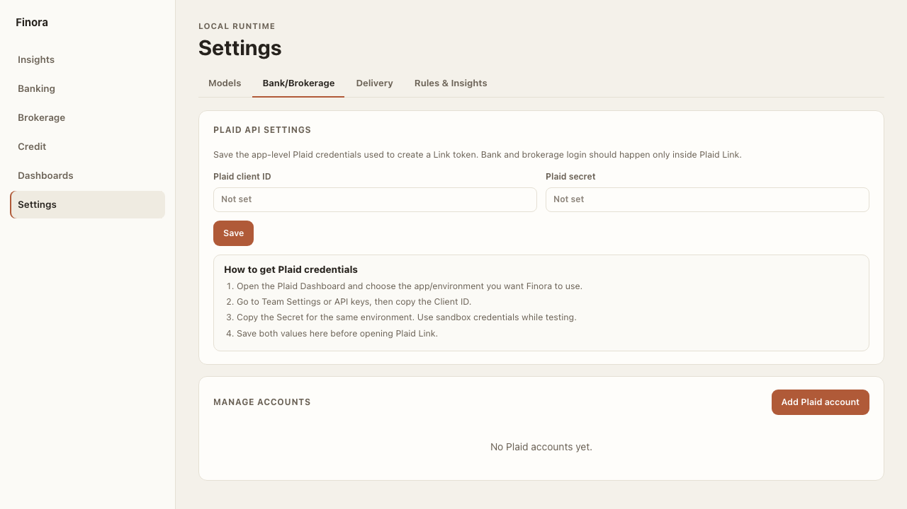

> **Heads up — Plaid's free tier is limited.** The free plan allows a running
> total of **10 connected financial institutions** across the life of your Plaid
> account; once you've used them up, adding more requires a paid Plaid plan. So
> connect the accounts that matter most and use them wisely. Check your current
> usage and the exact limits in your **Plaid Dashboard**.

**Connect the bank**

1. Go to **Banking** and click **Add bank account**.
2. A **Plaid Link** window opens. Choose your bank and sign in **inside that
   window** — your bank username and password go straight to Plaid, never to
   Finora.
3. Pick which accounts to include and finish.
4. Finora pulls in those accounts and their transactions. They now show up under
   **Banking**.

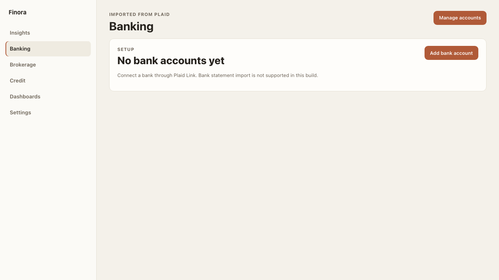

To change or disconnect accounts later, use **Manage accounts** (top-right of
Banking) — it reopens Plaid so the two stay in sync.

### Connect a brokerage account (through Plaid)

Investments connect the same way. If you already added your Plaid keys above, you
can skip straight to connecting.

1. Go to **Brokerage** and click **Add brokerage account**.
2. In the **Plaid Link** window, choose your brokerage and sign in there.
3. Finora imports your investment accounts and holdings, and they appear under
   **Brokerage**.

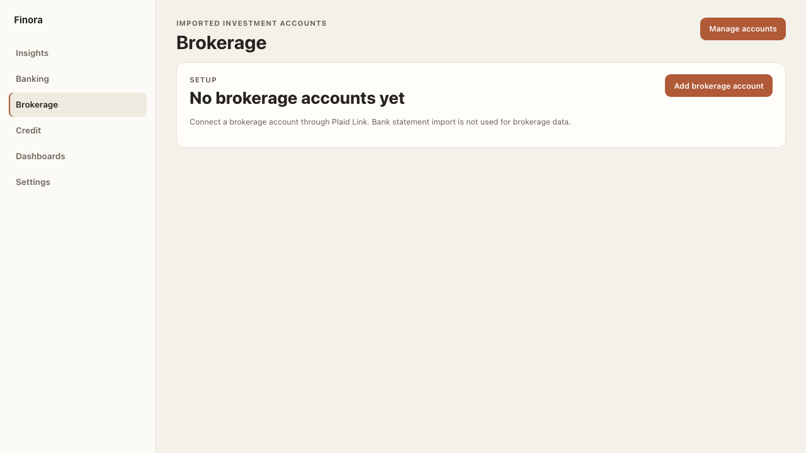

> Connecting a brokerage counts toward the same 10-institution Plaid free-tier
> total as banks.

### Add a credit report (PDF)

Credit reports come in as a PDF that **you** download — Finora never fetches your
report for you.

1. Go to **[AnnualCreditReport.com](https://www.annualcreditreport.com)** (the
   free, official U.S. site) and download your report as a **PDF**. Choose the
   downloadable/printable PDF, not a scan or screenshot, so the text is readable.
2. In Finora, open **Credit** and click **Manage reports**.
3. **Drop the PDF** onto the upload box, or click it to choose the file.
4. Finora reads the report on your computer and shows your open accounts,
   balances, credit-card usage, and inquiries — nothing is sent anywhere.

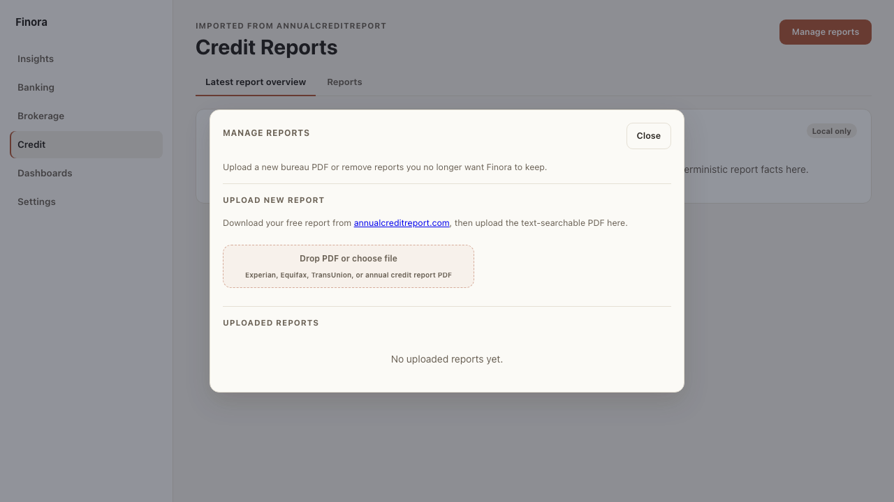

## 4. Find your way around

Here's what each area is for.

### Banking — your accounts and spending

Your day-to-day money. See balances, income vs. spending, where your money goes
by category, and your top merchants.

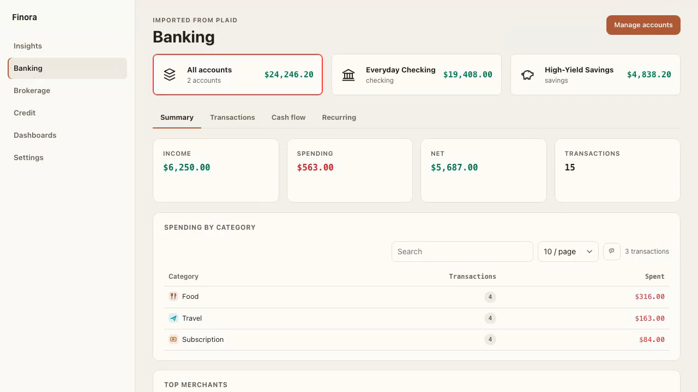

Once you've connected a bank, your transactions show up here — grouped by
category and merchant so you can see your spending at a glance.

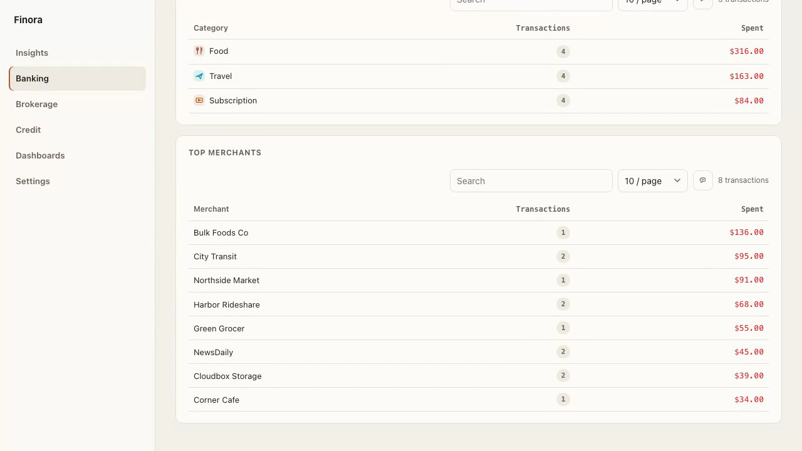

### Insights — what needs your attention

Finora looks over your accounts and points out things worth a glance — unusual
spending, high credit-card usage, cash sitting idle, or accounts that look out
of date. It's a quick way to spot problems without digging.

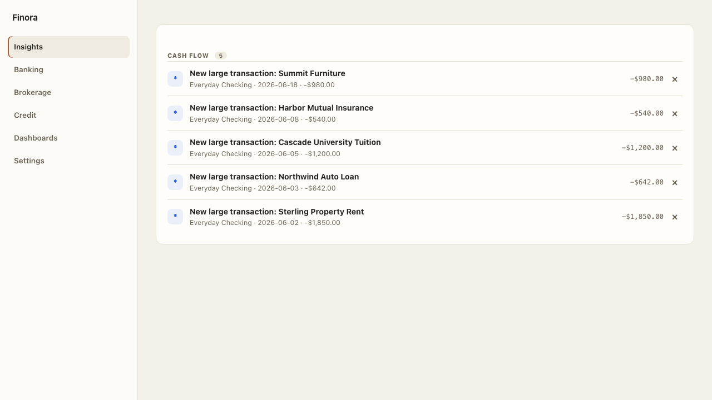

### Dashboards — charts from your data

Turn your numbers into simple charts, like monthly cash flow and spending by
category. You can add or hide charts without deleting any of your data.

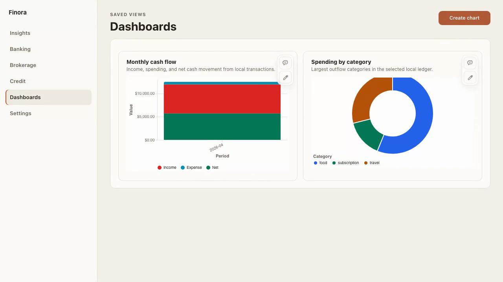

### Credit — review your credit report at home

After you add a report PDF (see above), this is where you review it. Finora
highlights your open accounts, credit-card usage, inquiries, and anything that
may be worth a second look.

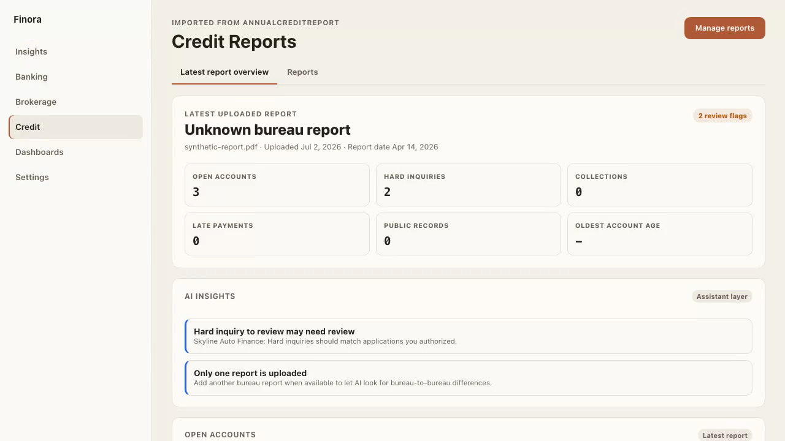

### Brokerage — your investments

Once connected, your holdings and balances appear here alongside your banking, so
you see everything together. Until then, this is where you start a connection.

### Settings — connections and alerts

Add your Plaid keys and manage connected accounts under **Bank/Brokerage**,
choose how you'd like to be notified under **Delivery**, and create alert rules
under **Rules & Insights**.

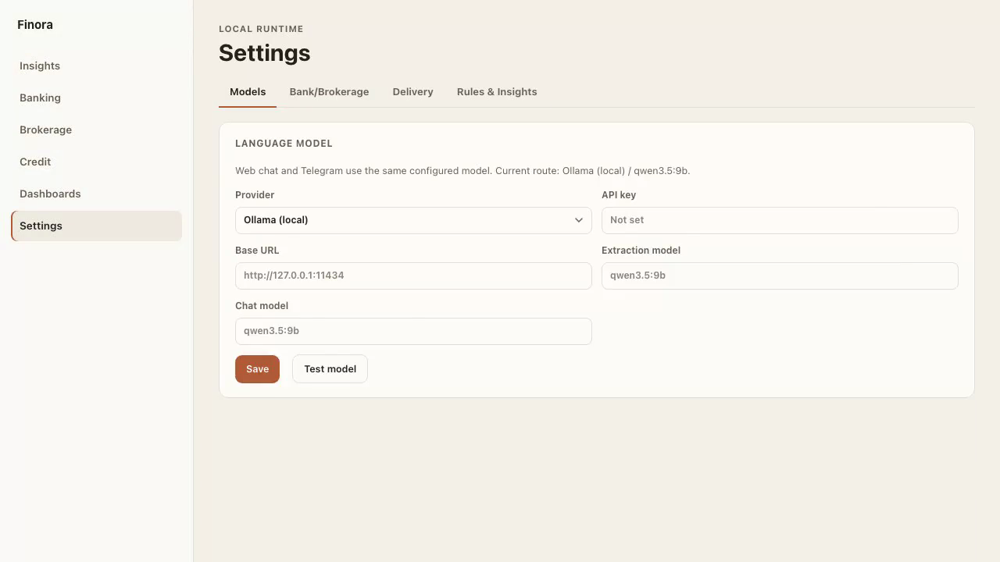

Want alerts to reach you outside the app? See
**[Get insights in Telegram or Slack](#5-get-insights-in-telegram-or-slack)**
below.

## 5. Get insights in Telegram or Slack

Everything in Finora stays on your computer, and the **Insights** feed always
lives there. If you'd like, you can also have Finora *push* rule-triggered
insights to a chat you already check — your own **Telegram** chat or a **Slack**
channel. Only the alerts you choose to send leave your machine, and you connect
each channel with your own bot credentials.

Open **Settings → Delivery** and pick a channel. Each one shows a short,
numbered setup right on the screen.

### Telegram — best for a personal heads-up

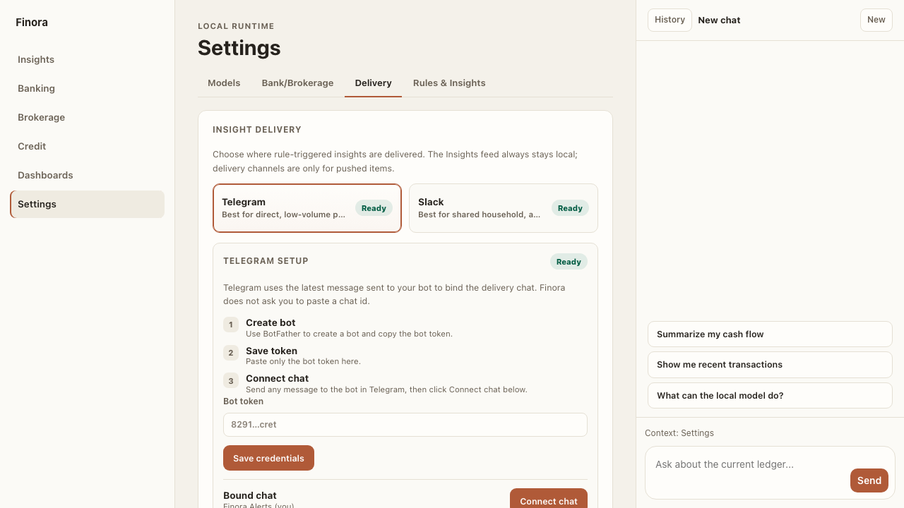

1. In Telegram, open **@BotFather**, send `/newbot`, and follow the prompts.
   Copy the **bot token** it gives you.
2. In Finora, go to **Settings → Delivery**, choose **Telegram**, paste the bot
   token into **Bot token**, and click **Save credentials**.
3. Open Telegram and **send any message to your new bot** (for example, "hi").
4. Back in Finora, click **Connect chat**. Finora reads that latest message to
   bind the delivery chat — you never have to paste a chat ID. When it shows
   **Ready** and a **Bound chat**, you're set.

> **Bonus:** Telegram is two-way. Once connected, you can message the bot to ask
> questions about your own accounts, transactions, and holdings — the answers
> come from the local model on your computer. Send `/help` to see what it can do.

### Slack — best for a shared household, advisor, or ops channel

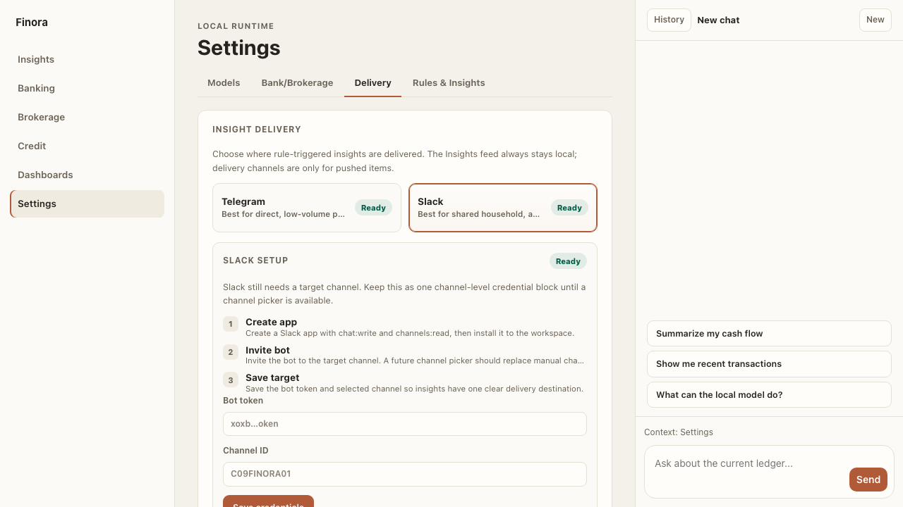

1. Create a **Slack app** with the `chat:write` and `channels:read` scopes, then
   install it to your workspace and copy the **Bot token** (starts with `xoxb-`).
2. **Invite the bot** to the channel where you want insights to land.
3. In Finora, go to **Settings → Delivery**, choose **Slack**, paste the **Bot
   token** and the target **Channel ID**, and click **Save credentials**. When
   it shows **Ready**, delivery is on.

Once a channel shows **Ready**, insights from your enabled rules (set up under
**Settings → Rules & Insights**) are delivered there. You can switch the active
channel or pause delivery any time — turning delivery off never changes or
deletes the local Insights feed.

---

*Building Finora from source or contributing code? See
[CONTRIBUTING.md](../CONTRIBUTING.md).*
